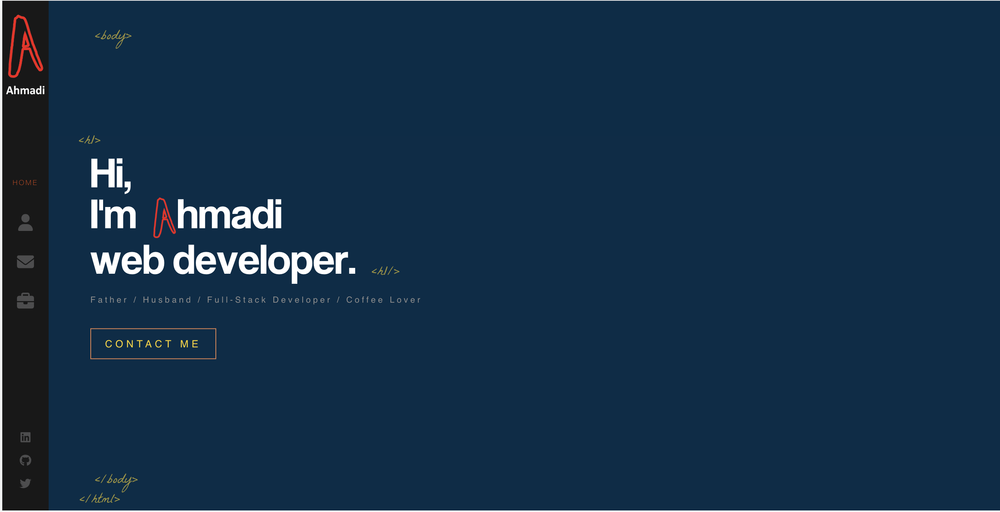

# React Portfolio

Hi there 👋. Thank you for visiting my portfolio repo. I made this portfolio for potential employeers and developers in order to see my work as well as to have access to my resume for more details. Feel free to fork this repo if you want to.

## License

## Installation

- Firstly, make sure to have `node.js` installed in your local machine.
- Also, install the required `npm dependencies`

## Usage

After cloning the repo, open the application in your favirite IDE and open up the terminal. Type `npm start` and the project will be opened in [http://localhost:3000](http://localhost:3000) port of your browser.

Screenshot:

## Contact

- Through Github: [@iqbalahmadi](https://github.com/iqbalahmadi)
- Via Email: iqb.ahmadi@gmail.com
